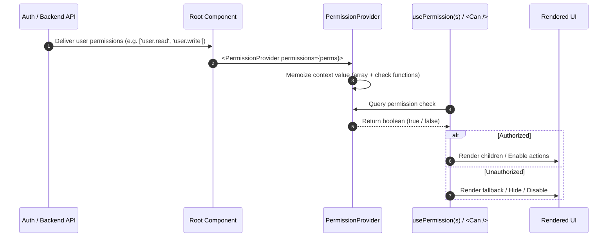

# 📚 `react-permission-kit` Technical Documentation & Architectural Guide

Welcome to the technical documentation for **`react-permission-kit`** — a high-performance, type-safe, zero-dependency authorization and access-control toolkit for React and modern JavaScript/TypeScript ecosystems.

---

## 📑 Table of Contents

1. [Architectural Overview](#1-architectural-overview)
2. [Data Flow & Lifecycle](#2-data-flow--lifecycle)
3. [Deep-Dive API Reference](#3-deep-dive-api-reference)
   - [Core Stateless Engine](#core-stateless-engine)
   - [React Context Layer](#react-context-layer)
   - [React Custom Hooks](#react-custom-hooks)
   - [Declarative `<Can />` Component](#declarative-can--component)
   - [TypeScript Type Definitions](#typescript-type-definitions)
4. [Performance & Optimization](#4-performance--optimization)
5. [Framework & Library Integrations](#5-framework--library-integrations)
   - [Next.js (App Router & Server Actions)](#nextjs-app-router--server-actions)
   - [React Router (v6 / v7)](#react-router-v6--v7)
   - [TanStack Router](#tanstack-router)
   - [State Managers (Zustand, Redux Toolkit)](#state-managers-zustand-redux-toolkit)
   - [Auth Providers (Auth0, Supabase, Firebase)](#auth-providers-auth0-supabase-firebase)
6. [Security Best Practices](#6-security-best-practices)
7. [Testing & Quality Assurance](#7-testing--quality-assurance)
8. [Troubleshooting & FAQs](#8-troubleshooting--faqs)

---

## 1. Architectural Overview

`react-permission-kit` is structured into three cleanly decoupled layers:

```
┌─────────────────────────────────────────────────────────────┐
│                       Application Layer                     │
│    (Components, Navigation, Actions, Views, Forms)          │
└──────────────┬───────────────────────────────┬──────────────┘
               │                               │
               ▼                               ▼
┌──────────────────────────────┐ ┌────────────────────────────┐
│      Declarative Layer       │ │      Imperative Layer      │
│        `<Can />`             │ │ `usePermission(s)` Hooks   │
└──────────────┬───────────────┘ └─────────────┬──────────────┘
               │                               │
               └───────────────┬───────────────┘
                               ▼
┌─────────────────────────────────────────────────────────────┐
│                 React Context State Layer                   │
│             `PermissionProvider` (Memoized Context)         │
└──────────────────────────────┬──────────────────────────────┘
                               ▼
┌─────────────────────────────────────────────────────────────┐
│                  Stateless Engine (Core)                    │
│   `hasPermission`, `hasAnyPermission`, `checkPermissions`   │
└─────────────────────────────────────────────────────────────┘
```

### Key Architectural Strengths

1. **Layer Decoupling**: The core logic (`src/core/permission.ts`) has **zero React dependencies**. It can run inside web workers, serverless functions, SSR loaders, and CLI tools.
2. **Deterministic Evaluation**: Pure functional verification means identical inputs always produce identical outputs with no hidden side-effects.
3. **Memoized Context Boundary**: The `PermissionProvider` wraps context values inside React's `useMemo`, ensuring context consumers re-render only when the underlying permissions array reference or contents change.
4. **Strict Rules of Hooks Compliance**: Components like `<Can />` invoke hooks unconditionally at the top level, avoiding conditional hook execution bugs.
5. **Zero Overhead**: Zero external dependencies ensures tiny bundle footprint (< 2 KB) and instantaneous load times.

---

## 2. Data Flow & Lifecycle



---

## 3. Deep-Dive API Reference

### Core Stateless Engine

Imported directly from `react-permission-kit`:

```ts
import { 
  hasPermission, 
  hasAnyPermission, 
  hasAllPermissions, 
  checkPermissions 
} from "react-permission-kit";
```

#### `hasPermission(permissions, permission): boolean`
Checks whether a target permission string exists in the granted permissions array.
- **Complexity**: $O(N)$ where $N$ is the number of granted permissions.
- **Parameters**:
  - `permissions: string[]` — Array of permissions held by the user.
  - `permission: string` — The required permission to test.
- **Returns**: `boolean`

#### `hasAnyPermission(permissions, requiredPermissions): boolean`
Returns `true` if the user possesses **at least one** permission from the `requiredPermissions` list.
- **Parameters**:
  - `permissions: string[]` — Array of permissions held by the user.
  - `requiredPermissions: string[]` — Target permissions.
- **Returns**: `boolean` (`false` if `requiredPermissions` is empty).

#### `hasAllPermissions(permissions, requiredPermissions): boolean`
Returns `true` if the user possesses **all** permissions in the `requiredPermissions` list.
- **Parameters**:
  - `permissions: string[]` — Array of permissions held by the user.
  - `requiredPermissions: string[]` — Required permissions list.
- **Returns**: `boolean` (`true` if `requiredPermissions` is empty — vacuously true).

#### `checkPermissions(permissions, requiredPermissions, mode?): boolean`
Unified permission evaluation engine.
- **Parameters**:
  - `permissions: string[]`
  - `requiredPermissions: string[]`
  - `mode?: "any" | "all"` *(Default: `"all"`)*
- **Returns**: `boolean` (`true` if `requiredPermissions` is empty).

---

### React Context Layer

#### `<PermissionProvider />`

The central state provider for component subtrees.

```tsx
import { PermissionProvider } from "react-permission-kit";

<PermissionProvider permissions={userPermissions}>
  {children}
</PermissionProvider>
```

#### Props

| Prop | Type | Description |
| :--- | :--- | :--- |
| `permissions` | `Permission[]` | Current permissions list assigned to the authenticated user or session. |
| `children` | `ReactNode` | Children nodes wrapped by the context. |

---

### React Custom Hooks

#### `usePermission(permission: Permission): boolean`

Verifies a single permission against the nearest `<PermissionProvider>`.

```tsx
import { usePermission } from "react-permission-kit";

function EditPostButton() {
  const canEdit = usePermission("posts.edit");

  if (!canEdit) {
    return null;
  }

  return <button>Edit Post</button>;
}
```

- **Throws Error**: If rendered outside `<PermissionProvider>`.
- **Return Value**: `true` if permission is present, otherwise `false`.

---

#### `usePermissions(permissions: Permission[], mode?: PermissionMode): boolean`

Verifies multiple permissions simultaneously.

```tsx
import { usePermissions } from "react-permission-kit";

function BillingReportSection() {
  // Requires both view AND export permissions
  const canManageBilling = usePermissions(["billing.view", "billing.export"], "all");

  // Requires either admin OR finance role
  const canAccessLogs = usePermissions(["logs.admin", "logs.finance"], "any");

  return (
    <div>
      {canManageBilling && <BillingExportWidget />}
      {canAccessLogs && <AuditLogViewer />}
    </div>
  );
}
```

---

### Declarative `<Can />` Component

Conditionally renders JSX based on permissions.

```tsx
import { Can } from "react-permission-kit";

<Can
  permission="orders.delete"
  fallback={<span className="locked-badge">Locked</span>}
>
  <button className="btn-danger">Delete Order</button>
</Can>
```

#### Multi-Permission Evaluation with `<Can />`

```tsx
{/* Match ANY permission */}
<Can permissions={["invoice.create", "invoice.edit"]} mode="any">
  <InvoiceToolbar />
</Can>

{/* Match ALL permissions */}
<Can permissions={["org.admin", "security.audit"]} mode="all" fallback={<AccessDenied />}>
  <SecurityAuditConsole />
</Can>

{/* When no permission is supplied, safely renders fallback */}
<Can fallback={<span>Access Denied</span>}>
  <SecretFeature />
</Can>
```

---

### TypeScript Type Definitions

All types are exported from root:

```ts
import type { 
  Permission, 
  PermissionMode, 
  PermissionContextValue, 
  PermissionProviderProps, 
  CanProps 
} from "react-permission-kit";
```

```ts
export type Permission = string;

export type PermissionMode = "any" | "all";

export interface PermissionContextValue {
  permissions: Permission[];
  hasPermission: (permission: Permission) => boolean;
  hasAnyPermission: (permissions: Permission[]) => boolean;
  hasAllPermissions: (permissions: Permission[]) => boolean;
  checkPermissions: (
    permissions: Permission[],
    mode?: PermissionMode
  ) => boolean;
}
```

---

## 4. Performance & Optimization

### 1. Memoized Provider Context
`PermissionProvider` internally wraps the context object with `useMemo`:

```ts
const value = useMemo<PermissionContextValue>(() => ({
  permissions,
  hasPermission: (perm) => hasPermission(permissions, perm),
  hasAnyPermission: (perms) => hasAnyPermission(permissions, perms),
  hasAllPermissions: (perms) => hasAllPermissions(permissions, perms),
  checkPermissions: (perms, mode = "all") => checkPermissions(permissions, perms, mode),
}), [permissions]);
```

### 2. Best Practices for High-Frequency Renders
- **Stable Array References**: If permissions come from state/props, avoid creating new array references inline inside parent render functions:
  ```tsx
  // ⚠️ AVOID (Creates new array reference on every parent render):
  <PermissionProvider permissions={user.roles.map(r => r.name)}>

  // ✅ RECOMMENDED (Memoize or compute during login/fetch):
  const permissions = useMemo(() => user.roles.map(r => r.name), [user.roles]);
  <PermissionProvider permissions={permissions}>
  ```

---

## 5. Framework & Library Integrations

### Next.js (App Router & Server Actions)

In Next.js App Router, use client-side `<PermissionProvider>` for interactive components and the stateless core for Server Components / Server Actions:

```tsx
// app/providers.tsx (Client Component)
"use client";

import { PermissionProvider } from "react-permission-kit";

export function ClientProviders({ 
  permissions, 
  children 
}: { 
  permissions: string[]; 
  children: React.ReactNode; 
}) {
  return (
    <PermissionProvider permissions={permissions}>
      {children}
    </PermissionProvider>
  );
}
```

```ts
// app/actions/user-actions.ts (Server Action / Server-side)
"use server";

import { hasPermission } from "react-permission-kit";
import { getCurrentUser } from "@/lib/auth";

export async function deleteUserAction(targetUserId: string) {
  const user = await getCurrentUser();
  
  // Use pure core function on the server
  if (!hasPermission(user.permissions, "user.delete")) {
    throw new Error("403 Forbidden: Insufficient permissions.");
  }

  // Execute deletion...
}
```

---

### React Router (v6 / v7)

Guarding entire subtrees and routes:

```tsx
// components/PermissionRouteGuard.tsx
import React from "react";
import { Navigate, Outlet } from "react-router-dom";
import { usePermissions } from "react-permission-kit";

interface Props {
  requiredPermissions: string[];
  mode?: "any" | "all";
  fallbackPath?: string;
}

export function PermissionRouteGuard({
  requiredPermissions,
  mode = "all",
  fallbackPath = "/forbidden",
}: Props) {
  const allowed = usePermissions(requiredPermissions, mode);

  if (!allowed) {
    return <Navigate to={fallbackPath} replace />;
  }

  return <Outlet />;
}
```

```tsx
// AppRoutes.tsx
import { Routes, Route } from "react-router-dom";
import { PermissionRouteGuard } from "./components/PermissionRouteGuard";
import { AdminPanel } from "./pages/AdminPanel";

export function AppRoutes() {
  return (
    <Routes>
      <Route element={<PermissionRouteGuard requiredPermissions={["admin.access"]} />}>
        <Route path="/admin" element={<AdminPanel />} />
      </Route>
    </Routes>
  );
}
```

---

### State Managers (Zustand, Redux Toolkit)

#### With Zustand:
```tsx
import create from "zustand";
import { PermissionProvider } from "react-permission-kit";

interface AuthState {
  user: { id: string; email: string; permissions: string[] } | null;
}

const useAuthStore = create<AuthState>((set) => ({
  user: null,
}));

export function RootLayout({ children }: { children: React.ReactNode }) {
  const permissions = useAuthStore((s) => s.user?.permissions || []);

  return (
    <PermissionProvider permissions={permissions}>
      {children}
    </PermissionProvider>
  );
}
```

---

### Auth Providers (Auth0, Supabase, Firebase)

#### With Supabase:
```tsx
import { useEffect, useState } from "react";
import { supabase } from "@/lib/supabaseClient";
import { PermissionProvider } from "react-permission-kit";

export function AuthWrapper({ children }: { children: React.ReactNode }) {
  const [permissions, setPermissions] = useState<string[]>([]);

  useEffect(() => {
    async function loadPermissions() {
      const { data: { session } } = await supabase.auth.getSession();
      if (session?.user) {
        // Fetch permissions or decode app_metadata / claims
        const userPerms = session.user.app_metadata?.permissions || [];
        setPermissions(userPerms);
      }
    }
    loadPermissions();
  }, []);

  return (
    <PermissionProvider permissions={permissions}>
      {children}
    </PermissionProvider>
  );
}
```

---

## 6. Security Best Practices

> [!WARNING]
> **Client-Side vs Server-Side Enforcement**:
> Client-side permission checks improve User Experience (UX) by concealing buttons, forms, and pages that a user cannot access. However, **client-side checks can be bypassed by knowledgeable actors**.
> 
> **Always enforce permission checks on the backend / API layer** in addition to frontend UI checks with `react-permission-kit`.

1. **Principle of Least Privilege**: Grant users only the minimum necessary permissions.
2. **Granular Permissions over Generic Roles**: Favor permission strings (e.g. `"invoices:export"`) over monolithic roles (e.g. `"admin"`). This allows easy role modification without altering UI code.
3. **Synchronize On Auth Refresh**: Re-issue and update permissions immediately whenever the user changes organizations, refreshes their JWT token, or updates privileges.

---

## 7. Testing & Quality Assurance

Using Vitest and React Testing Library:

```tsx
import { describe, it, expect } from "vitest";
import { render, screen } from "@testing-library/react";
import { PermissionProvider, Can } from "react-permission-kit";

describe("Access Control in Dashboard", () => {
  it("renders export button for authorized users", () => {
    render(
      <PermissionProvider permissions={["reports.export"]}>
        <Can permission="reports.export">
          <button>Export Data</button>
        </Can>
      </PermissionProvider>
    );

    expect(screen.getByRole("button", { name: "Export Data" })).toBeInTheDocument();
  });

  it("renders fallback message when unauthorized", () => {
    render(
      <PermissionProvider permissions={["reports.view"]}>
        <Can permission="reports.export" fallback={<p>No Export Access</p>}>
          <button>Export Data</button>
        </Can>
      </PermissionProvider>
    );

    expect(screen.queryByRole("button", { name: "Export Data" })).not.toBeInTheDocument();
    expect(screen.getByText("No Export Access")).toBeInTheDocument();
  });

  it("renders fallback when no permissions are specified", () => {
    render(
      <PermissionProvider permissions={["reports.view"]}>
        <Can fallback={<p>No Permission Defined</p>}>
          <button>Dangerous Action</button>
        </Can>
      </PermissionProvider>
    );

    expect(screen.queryByRole("button", { name: "Dangerous Action" })).not.toBeInTheDocument();
    expect(screen.getByText("No Permission Defined")).toBeInTheDocument();
  });
});
```

---

## 8. Troubleshooting & FAQs

### Q: Why do I get `"usePermission must be used inside a PermissionProvider"`?
**A**: This error occurs when `usePermission()`, `usePermissions()`, or `<Can />` is rendered in a component hierarchy that does not have `<PermissionProvider>` above it. Ensure `<PermissionProvider>` wraps your app at or near the root level.

### Q: How do I support hierarchical permissions (e.g. `"admin.*"` wildcard)?
**A**: You can normalize/expand wildcards when building the permissions array passed to `<PermissionProvider permissions={expandedPermissions}>`.

### Q: Does this package work with React Server Components (RSC)?
**A**: Yes! The core functions (`hasPermission`, etc.) can be called inside React Server Components and Server Actions. For client components and JSX tree gating, wrap the client tree in `<PermissionProvider>`.
